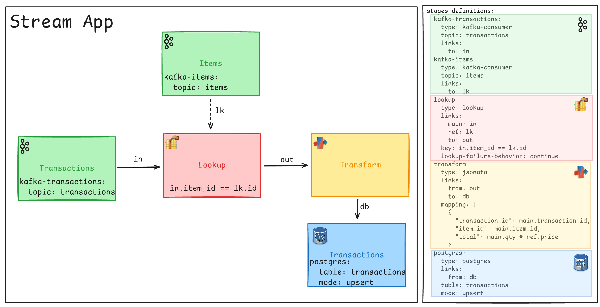

# kanal
> A « Boring by Design » stream processing engine for Apache Kafka

## Overview

Kanal is a stream processing engine designed to be simple, reliable, and boringly efficient by just focusing on the 80% of use cases that matter the most.

Things that make Kanal different:
- UI-first development approach
- JSONata for stateless processing (map, filter, branch, etc.)
- End-to-end concerns with external services calls (HTTP, DB, etc.)
- Focus on event-driven applications, transactional world (Don't care about analytics world)
- Decentralized architecture (no central coordinator)

Kanal comes batteries included:
- HTTP Server to visualize/operate/monitor your running pipeline

## Non-goals

Kanal has a limited set of features and intentionally avoids complexity:
- Limited stateful processing
- No windowing or Stream-Stream joins
- Stream-Table joins only if the Table is small enough to fit in memory

## Roadmap

## But...

### What about Kafka Streams?
**Use Kafka Streams if you need advanced stateful processing.**

I love the autonomy it gives application teams, and I want to keep that, but:
- Too complicated to do simple things
- Too many concepts to learn
- Doesn't come with batteries included (monitoring, operability, etc.)
- Requires coding everything in Java

### What about Apache Flink?
- Looks great for Analytics, but overkill for simple stream processing tasks.
- Also centralized, so you need a platform team to manage it.

### What about ksqlDB?

